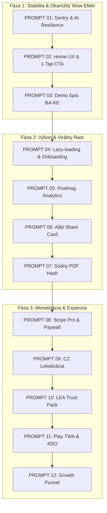

# ForenzDetectiv — Katalóg stredne veľkých implementačných promptov

> **Účel dokumentu:** Tento dokument transformuje pôvodnú master stratégiu a zoznam úloh projektu **ForenzDetectiv** na sadu modulárnych, priamo spustiteľných **stredne veľkých promptov (Medium-Sized Prompts)** pre AI agentov (Cursor, Antigravity, Claude Code, Copilot) alebo vývojárov.
>
> **Štruktúra každého promptu:**
> 1. **Cieľ & Kontext:** Čo a kde sa ide robiť.
> 2. **Technická špecifikácia:** Presné kroky, dátové toky, komponenty a logika.
> 3. **Dizajn & UX pravidlá:** Farby (`slate-950`, `amber-500`), typografia, mikrointerakcie.
> 4. **Error handling & Bezpečnosť:** Ochrana pred pádmi, validácie, GDPR/RLS.
> 5. **Akceptačné kritériá:** Ako overiť úspešnosť implementácie.

---

## 🗺️ Prehľad promptov (Execution Roadmap)

| # | Kód promptu | Názov a zameranie | Priorita | Odhadovaný čas |
|---|-------------|-------------------|----------|----------------|
| **01** | `PROMPT-01-STABILITY` | Sentry, Globálny ErrorBoundary & Resilientný AI Retry Engine | **P0** (Kritická) | 8 – 12 h |
| **02** | `PROMPT-02-HOME-UX` | UX Redizajn Domovskej Obrazovky: Empty State & 1-Tap CTA | **P0** (Kritická) | 12 – 16 h |
| **03** | `PROMPT-03-DEMO-CASE` | Interaktívny Demo Spis BA-KE & Auto-Jump na Contradiction Board | **P0** (Kritická) | 10 – 14 h |
| **04** | `PROMPT-04-LAZY-ONBOARDING` | Streamline Onboardingu (1-Tip) & Lazy-Loading Ťažkých Modulov | **P1** (Vysoká) | 8 – 12 h |
| **05** | `PROMPT-05-ANALYTICS` | Privacy-First Product Analytics (PostHog 8 Kľúčových Udalostí) | **P1** (Vysoká) | 6 – 10 h |
| **06** | `PROMPT-06-ALIBI-CARD` | Virálna Karta „Alibi Impossible“ & Generátor Zdieľania | **P1** (Vysoká) | 8 – 12 h |
| **07** | `PROMPT-07-PDF-HASH` | Súdny PDF Protokol s Kryptografickým SHA-256 Hashom | **P1** (Vysoká) | 10 – 14 h |
| **08** | `PROMPT-08-STRIPE-PRO` | Monetizácia: Stripe Pro Tier, Paywall Limity & Referral Systém | **P2** (Stredná) | 14 – 18 h |
| **09** | `PROMPT-09-CZ-I18N` | Multijazyčnosť & Česká Lokalizácia (i18n & Právna Terminológia) | **P2** (Stredná) | 12 – 16 h |
| **10** | `PROMPT-10-LEA-TRUST` | LEA & Legal Trust Pack (Bezpečnostný Portál & Audit Log v2) | **P2** (Stredná) | 10 – 14 h |
| **11** | `PROMPT-11-PWA-TWA` | PWA / TWA Pripravenosť pre Google Play & ASO Balíček | **P2** (Stredná) | 8 – 12 h |
| **12** | `PROMPT-12-GROWTH-LOOP` | B2B Growth Funnel, Landing Page Playground & Retargeting | **P3** (Škálovanie) | 12 – 16 h |

---

```markdown
<!-- ================================================================= -->
<!-- PROMPT 01: SENTRY, ERROR BOUNDARY & AI RETRY ENGINE               -->
<!-- ================================================================= -->
```

### 🧩 PROMPT 01: Sentry, Globálny ErrorBoundary & Resilientný AI Retry Engine

```text
[POKYN PRE AI AGENTA / VÝVOJÁRA]

Kontext projektu:
ForenzDetectiv je React (Vite) aplikácia pre kriminalistickú a právnu analýzu spisov. Aplikácia spracováva citlivé texty, PDF, OCR a AI detekciu rozporov. Aktuálne chýba centralizovaný Error Boundary a pri výpadkoch API (napr. HTTP 429 Rate Limit z Mistral/OpenAI) alebo pri veľkých súboroch hrozí zamrznutie UI či pád bez spätnej väzby.

Cieľ:
Implementovať robustný systém zachytávania chýb (Sentry + React ErrorBoundary) a resilientnú vrstvu pre volanie AI a spracovanie súborov s automatickým opakovaním (exponential backoff) a ochranou pamäte.

Dotknuté súbory:
- src/components/ErrorBoundary.jsx (NOVÝ)
- src/lib/sentry.js (NOVÝ / AKTUALIZÁCIA)
- src/lib/aiClient.js alebo src/api/base44Client.js (AKTUALIZÁCIA)
- src/App.jsx (obalenie tras a kritických komponentov)
- src/utils/fileProcessor.js (ochrana pred OOM pri hromadnom nahrávaní)

Požiadavky na implementáciu:
1. ErrorBoundary:
   - Vytvor React Error Boundary komponent s pekným tmavým dizajnom (slate-950 podklad, slate-800 karta, amber/red akcent).
   - Obsah pri páde: Informácia o bezpečnom izolovaní chyby, tlačidlá "Skúsiť znova", "Stiahnuť diagnostický log", "Návrat na Domov".
   - Zabezpeč, aby chyba v jednom paneli (napr. 2D graf vzťahov alebo mapa) nezhodila celú aplikáciu, ale len daný widget s možnosťou reloadu.

2. Sentry inicializácia (src/lib/sentry.js):
   - Inicializuj Sentry len ak je definovaná VITE_SENTRY_DSN premenná prostredia (inak fallback na console.warn bez pádu).
   - Nastav sampleRate a odfiltruj citlivé dáta (anonymizuj texty spisov a osobné údaje – GDPR / advokátske tajomstvo).

3. AI Retry & Rate Limit Handling:
   - Vo vrstve volania AI analýzy pridaj retry mechanizmus pri stavoch HTTP 429 a 503 s exponenciálnym oneskorením (1s, 2s, 4s) a max. 3 pokusmi.
   - Používateľovi v UI zobrazuj stav: "AI server je vyťažený, opakujem pokus (1/3)..." namiesto generickej chyby.

4. Bulk Upload OOM ochrana:
   - Pri nahrávaní viacerých PDF/obrázkov naraz nespracovávaj všetky paralelne. Vytvor frontu (batch veľkosť max 2 súbory súčasne), aby nedošlo k vyčerpaniu RAM prehliadača.

Akceptačné kritériá & Verifikácia:
- Spusti `npm test` a uisti sa, že existujúce testy prechádzajú.
- Vytvor testovací umelý pád v komponente a over, že ErrorBoundary zobrazí fallback UI a nezhodí celú stránku.
- Over, že simulovaný výpadok AI API spustí retry a zobrazí používateľovi zrozumiteľný toast/stav.
```

---

```markdown
<!-- ================================================================= -->
<!-- PROMPT 02: HOME UX REDESIGN (EMPTY STATE & 1-TAP CTA)            -->
<!-- ================================================================= -->
```

### 🧩 PROMPT 02: UX Redizajn Domovskej Obrazovky: Empty State & 1-Tap CTA

```text
[POKYN PRE AI AGENTA / VÝVOJÁRA]

Kontext projektu:
Používateľ po otvorení ForenzDetectiv vidí často prázdny alebo neprehľadný dashboard bez okamžitého volania k akcii. Podľa analýzy 80% používateľov opustí aplikáciu, ak do 10 sekúnd nepochopia hlavnú hodnotu alebo nevidia možnosť jedným klikom vyskúšať analýzu.

Cieľ:
Prepracovať Domovskú stránku (Home / Dashboard) a prázdny stav na moderné, úderné prostredie s okamžitou hodnotou, 1-tap primárnym CTA a priamym spustením demo spisu.

Dotknuté súbory:
- src/pages/ForenzDetectiv.jsx
- src/pages/Dashboard.jsx
- src/components/home/HomeHero.jsx (NOVÝ)
- src/components/home/QuickActionCard.jsx (NOVÝ)
- src/index.css (aktualizácia farebných tokenov a micro-animácií)

Požiadavky na implementáciu:
1. Hero sekcia & Headline:
   - Nadpis: "ForenzDetectiv — Odhaľte skryté rozpory a nemožné alibi"
   - Podnadpis: "Prvá slovenská AI pre analýzu vyšetrovacích spisov a výpovedí so 100% citáciou zo zdroja."
   - Badges/Proof strip: "⚡ Detekcia rozporov", "🗺️ SK Alibi mapa", "🔒 Bezpečné lokálne šifrovanie", "📄 Súdny PDF export".

2. Dva hlavné 1-Tap CTA prvky:
   - Primárny CTA (Dominantný amber-500 tlačidlo): "📂 Nahrať spis / výpoveď (PDF, foto, text)" s podporou Drag & Drop priamo do plochy.
   - Sekundárny CTA (Sleek slate-800 s amber orámovaním): "⚡ Vyskúšať Demo spis: Kauza Bratislava – Košice" (okamžitý štart analýzy na 1 klik bez nutnosti nahrávania súborov).

3. Vizuálna hierarchia a farby:
   - Podklad: Hlboká tmavá `slate-950` (#020617), karty v `slate-900` s jemným okrajom `border-white/10`.
   - Primárne akcenty: `amber-500` (#f59e0b) pre akcie, `blue-400` (#60a5fa) pre grafy/vzťahy, `red-500` (#ef4444) pre rozpory.
   - Plynulé animácie prechodu (Framer Motion alebo CSS transitions) pri nabehnutí na karty.

4. Responzivita:
   - Na mobile (PWA) umiestni akčné tlačidlá na dosah palca (spodná fixná lišta alebo výrazný hero banner).

Akceptačné kritériá & Verifikácia:
- Domovská stránka bez nahratého spisu musí okamžite ponúkať obe akcie (Nahrať / Demo).
- Drag & Drop do celej plochy Hero sekcie automaticky otvorí dialóg spracovania.
- Vizuál spĺňa dizajn systém (žiadne nekonzistentné fialové gradienty, čistý slate/amber štýl).
- Over v prehliadači na desktope aj mobilnom viewport rozlíšení (390px).
```

---

```markdown
<!-- ================================================================= -->
<!-- PROMPT 03: INTERAKTÍVNY DEMO SPIS BA-KE & AUTO-JUMP             -->
<!-- ================================================================= -->
```

### 🧩 PROMPT 03: Interaktívny Demo Spis BA-KE & Auto-Jump na Contradiction Board

```text
[POKYN PRE AI AGENTA / VÝVOJÁRA]

Kontext projektu:
Hlavný "Aha! moment" aplikácie ForenzDetectiv nastáva v momente, keď vyšetrovateľ uvidí detegovaný rozpor medzi dvomi výpoveďami s presnou citáciou (`source_quote`) a geograficky nemožné alibi (presun 450 km Bratislava -> Košice za 40 minút). Nový používateľ potrebuje tento moment zažiť do 30 sekúnd cez predpripravený realistický slovenský spis.

Cieľ:
Vytvoriť interaktívny demo dataset a mechanizmus jednoklikového spustenia, ktorý vykoná bleskovú simulovanú analýzu a automaticky prepne používateľa priamo na Contradiction Board s vysvetľujúcim calloutom.

Dotknuté súbory:
- src/data/demoCaseData.js (NOVÝ / ROZŠÍRENIE)
- src/components/demo/DemoCaseRunner.jsx (NOVÝ)
- src/pages/ForenzDetectiv.jsx (integrácia handleru)
- src/components/contradictions/ContradictionBoard.jsx (zvýraznenie demo prípadu)
- src/components/map/AlibiGeoMap.jsx (vykreslenie trasy BA-KE)

Požiadavky na implementáciu:
1. Slovenský demo dataset (`demoCaseData.js`):
   - 3 realistické výpovede svedkov / podozrivých:
     * Výpoveď A (Svedok Kováč): "O 14:15 som videl podozrivého v kaviarni v Bratislave na Dunajskej ulici."
     * Výpoveď B (Podozrivý Novák): "V čase 14:55 som bol doma v Košiciach na Hlavnej ulici a sledoval televíziu."
     * Výpoveď C (Kamerový záznam / Predajňa): "Platba kartou podozrivého o 14:30 v Trnave."
   - Metadáta: Geolokácie (Bratislava: 48.1486, 17.1077; Trnava: 48.3775, 17.5883; Košice: 48.7164, 21.2611).

2. Logika analýzy a výpočtu:
   - Haversine kalkulácia rýchlosti: Vzdialenosť BA - KE je ~450 km. Časový rozdiel: 40 minút (0.66 h).
   - Vypočítaná priemerná rýchlosť: ~675 km/h -> Klasifikácia: ❌ **NEMOŽNÉ ALIBI (Impossible Speed Violation)**.
   - Textový rozpor: Výpoveď A a C vyvracajú tvrdenie podozrivého o pobyte v Košiciach.

3. Priebeh UX po kliknutí "Spustiť Demo":
   - Zobraz krátku 1.5s vizuálnu simuláciu priebehu: "Indexovanie výpovedí... -> Porovnávanie časových osí... -> Detekcia rozporov hotová!".
   - Auto-jump priamo na záložku "Rozpory & Alibi".
   - Zobraz uvítací toast s tipom: "Ukážka rozporu: Pozrite si citáciu zo zdroja a mapu nemožného presunu."

Akceptačné kritériá & Verifikácia:
- Kliknutie na tlačidlo "Demo spis" bez predchádzajúceho nahrávania okamžite naplní stav aplikácie.
- Contradiction Board zobrazí minimálne 2 jasné rozpory s označením strany/odseku a presným citátom.
- Mapa alibi správne vykreslí body Bratislava a Košice s červenou spojnicou indikujúcou nemožnú rýchlosť.
```

---

```markdown
<!-- ================================================================= -->
<!-- PROMPT 04: ONBOARDING STREAMLINE & LAZY-LOADING MODULES          -->
<!-- ================================================================= -->
```

### 🧩 PROMPT 04: Streamline Onboardingu (1-Tip) & Lazy-Loading Ťažkých Modulov

```text
[POKYN PRE AI AGENTA / VÝVOJÁRA]

Kontext projektu:
Aplikácia aktuálne obsahuje viacstránkový modálny onboarding, ktorý zdržuje používateľa pred dosiahnutím hodnoty. Zároveň importuje všetky ťažké knižnice naraz na úvodnej stránke (Leaflet mapy, 2D grafy `react-force-graph-2d`, PDF generátory `jspdf`, Three.js, Tesseract OCR), čo spomaľuje počiatočný FCP a LCP bundle.

Cieľ:
1. Zjednodušiť onboarding na 1 nenápadný, neblokujúci interaktívny tip s možnosťou "Už nezobrazovať".
2. Rozdeliť aplikáciu pomocou `React.lazy()` a `Suspense` na dynamicky načítavané moduly s elegantnými skeleton loaders.

Dotknuté súbory:
- src/components/onboarding/QuickTip.jsx (NOVÝ namiesto viacstránkového sprievodcu)
- src/App.jsx / src/pages/ForenzDetectiv.jsx (zavedenie lazy-importov)
- src/components/ui/SkeletonViews.jsx (NOVÝ)
- vite.config.js (optimalizácia chunkov)

Požiadavky na implementáciu:
1. Onboarding v2:
   - Odstráň 3-krokový modálny dialóg.
   - Vytvor malý plávajúci "Smart Tip" na spodku obrazovky: "💡 Tip: Nahrajte 2 výpovede a AI automaticky porovná časy a miesta." s tlačidlom "Rozumiem (x)".
   - Stav ulož do `localStorage` (`forenz_onboarding_dismissed`).

2. Lazy-Loading pre ťažké záložky/panely:
   - `ReactForceGraph2D` (Graf vzťahov) načítaj až pri prepnutí na záložku "Graf".
   - `ReactLeaflet` (Alibi Mapa) načítaj až pri otvorení alibi modulu.
   - `Tesseract.js` (OCR) načítaj len vtedy, keď používateľ nahrá obrázok / sken.
   - `jspdf` a `@pdf-lib/fontkit` načítaj až pri kliknutí na "Exportovať PDF protokol".

3. Skeleton Loaders:
   - Pri načítavaní dynamických častí zobraz tmavý pulzujúci skeleton (slate-900 karty s animovaným shimmer efektom).

Akceptačné kritériá & Verifikácia:
- Spusti `npm run build` a skontroluj veľkosť hlavného `index.js` bundlu (musí byť citeľne menší, ťažké knižnice oddelené do samostatných chunkov).
- Over, že prvá návšteva nezobrazí blokujúci modal, ale stránka je okamžite interaktívna.
- Prepínanie záložiek funguje plynule bez zásekov so zobrazením skeletonu pri prvom načítaní.
```

---

```markdown
<!-- ================================================================= -->
<!-- PROMPT 05: PRIVACY-FIRST PRODUCT ANALYTICS (POSTHOG)             -->
<!-- ================================================================= -->
```

### 🧩 PROMPT 05: Privacy-First Product Analytics (PostHog 8 Kľúčových Udalostí)

```text
[POKYN PRE AI AGENTA / VÝVOJÁRA]

Kontext projektu:
Aby sme vedeli merať North Star metriku (*Weekly Active Investigators s aspoň 1 contradiction_viewed*) a optimalizovať konverzné lieviky, potrebujeme presnú telemetriu. Keďže však ide o forenzný a právny softvér, **žiadne osobné údaje, mená svedkov ani texty výpovedí nesmú byť odosielané do analytiky** (GDPR, anonymizácia).

Cieľ:
Implementovať centralizovanú vrstvu pre PostHog analytiku so sledovaním 8 definovaných biznis udalostí a striktnou anonymizáciou payloadov.

Dotknuté súbory:
- src/lib/analytics.js (NOVÝ)
- src/pages/ForenzDetectiv.jsx
- src/components/demo/DemoCaseRunner.jsx
- src/components/contradictions/ContradictionCard.jsx
- src/components/export/PdfExportButton.jsx

Požiadavky na implementáciu:
1. Analytics modul (`src/lib/analytics.js`):
   - Inicializácia PostHog cez `posthog-js` len ak je nastavený `VITE_POSTHOG_KEY`.
   - Režim bezpečný pre offline: Ak je sieť offline alebo kľúč chýba, funkcie nesmú vyhadzovať chyby (`no-op fallback`).
   - Automatické vypnutie zaznamenávania textov z inputov (`mask_all_text: true`, `mask_all_element_attributes: true`).

2. Implementuj 8 kľúčových eventov:
   1. `case_created` { source: 'upload' | 'demo' | 'manual', file_count: number }
   2. `file_uploaded` { file_type: 'pdf' | 'img' | 'txt', size_kb: number }
   3. `contradiction_detected` { count: number, has_alibi_conflict: boolean }
   4. `contradiction_viewed` (North Star) { contradiction_type: string, time_to_view_sec: number }
   5. `alibi_checked` { status: 'possible' | 'impossible' | 'suspicious', speed_kmh: number }
   6. `demo_launched` { case_id: 'ba-ke' }
   7. `pdf_exported` { page_count: number, with_hash: boolean }
   8. `share_card_generated` { type: 'alibi_impossible' }

3. Anonymizácia dát:
   - Zabezpeč utilitu `sanitizePayload(data)`, ktorá pred odoslaním vymaže kľúče ako `name`, `text`, `quote`, `ssn`, `location_raw`.

Akceptačné kritériá & Verifikácia:
- V konzole v dev móde (`import.meta.env.DEV`) sa vypisuje log odoslaných eventov so sanitizovanými parametrami.
- Spustenie demo spisu odošle eventy `demo_launched` a následne `contradiction_detected`.
- Zobrazenie detailu rozporu odošle event `contradiction_viewed`.
```

---

```markdown
<!-- ================================================================= -->
<!-- PROMPT 06: ALIBI IMPOSSIBLE SHARE CARD (VIRAL FEATURE)           -->
<!-- ================================================================= -->
```

### 🧩 PROMPT 06: Virálna Karta „Alibi Impossible“ & Generátor Zdieľania

```text
[POKYN PRE AI AGENTA / VÝVOJÁRA]

Kontext projektu:
Pre organický B2B a peer-to-peer rast medzi advokátmi, vyšetrovateľmi a študentmi práva potrebujeme vizuálne atraktívny exportný artefakt – kartu nemožného alibi / detegovaného rozporu, ktorú môže používateľ jedným klikom stiahnuť ako PNG alebo zdieľať na LinkedIn/sociálnych sieťach.

Cieľ:
Vytvoriť komponent `AlibiShareCard` s prémiovým vizuálom (dark mode, trasa na mape, časový paradox, pečiatka "ForenzDetectiv AI Analysis"), ktorý sa pomocou `html2canvas` vygeneruje do stiahnuteľného obrázku.

Dotknuté súbory:
- src/components/share/AlibiShareCard.jsx (NOVÝ)
- src/components/share/ShareModal.jsx (NOVÝ)
- src/components/contradictions/ContradictionCard.jsx (pridanie tlačidla Zdieľať)
- src/utils/imageExporter.js (NOVÝ)

Požiadavky na implementáciu:
1. Vizuálna štruktúra karty (rozmer 1200x630 px pre sociálne siete / retina):
   - Hlavička: Logo ForenzDetectiv + badge "⚠️ GEOGRAFICKY NEMOŽNÉ ALIBI".
   - Stred:
     * Bod A: Bratislava (14:15) ➡️ Bod B: Košice (14:55)
     * Vzdialenosť: 450 km | Časový interval: 40 min
     * Požadovaná rýchlosť: **675 km/h** (Pozemné vozidlo: Fyzikálne nemožné)
   - Citácia zo zdroja: Zvýraznený výňatok zo spisu (napr. *"Videl som ho o 14:15 v BA..." vs "...o 14:55 som bol v KE"*).
   - Päta: "Overené systémom ForenzDetectiv · forenzdetectiv.sk" s drobným QR kódom smerujúcim na demo.

2. Generovanie obrázku:
   - Použi existujúci balíček `html2canvas`.
   - Poskytni 2 možnosti v modálnom okne:
     1. "Stiahnuť PNG obrázok" (pre prezentácie, posudky, sociálne siete).
     2. "Kopírovať do schránky" (pre rýchle vloženie do e-mailu / správy).
     3. "Zdieľať na LinkedIn" (s predvyplneným textom o detekcii rozporov).

3. Anonymizačný prepínač pred exportom:
   - Pridaj checkbox: "Anonymizovať mená (nahradiť za Osoba A / Svedok B)" pre prípad, že používateľ analyzuje reálny spis a chce zdieľať len ukážku paradoxu.

Akceptačné kritériá & Verifikácia:
- Kliknutie na ikonu zdieľania pri detaile nemožného alibi otvorí náhľad karty.
- Vygenerovaný PNG súbor má ostré písmo, správne zarovnanie a tmavý prémiový dizajn.
- Prepínač anonymizácie okamžite aktualizuje text na karte.
```

---

```markdown
<!-- ================================================================= -->
<!-- PROMPT 07: COURT-READY PDF PROTOCOL WITH SHA-256 HASH             -->
<!-- ================================================================= -->
```

### 🧩 PROMPT 07: Súdny PDF Protokol s Kryptografickým SHA-256 Hashom

```text
[POKYN PRE AI AGENTA / VÝVOJÁRA]

Kontext projektu:
Výstupy z ForenzDetectiv slúžia ako podklad pre advokátov, interných vyšetrovateľov a znalcov. Pre právnu váhu dokumentu je nevyhnutné, aby vygenerovaný PDF protokol obsahoval formálnu hlavičku, reťazec dôkazov (Chain of Custody), presné citácie strán a kryptografický kontrolný súčet (SHA-256 digest) celého analyzovaného spisu.

Cieľ:
Prepracovať generovanie PDF protokolu na formálny, súdne použiteľný dokument s kryptografickým odtlačkom integrity dát.

Dotknuté súbory:
- src/utils/pdfExport.js (alebo src/lib/courtPdfGenerator.js)
- src/utils/cryptoUtils.js (NOVÝ - výpočet SHA-256 hashu)
- src/components/export/PdfExportDialog.jsx (NOVÝ)

Požiadavky na implementáciu:
1. Kryptografická integrita (`cryptoUtils.js`):
   - Použi štandardné `crypto.subtle.digest('SHA-256', data)` na výpočet hashu z textu všetkých vložených výpovedí.
   - Tento hash slúži ako nemenný odtlačok stavu spisu v čase analýzy.

2. Štruktúra generovaného PDF protokolu (A4 formát, čistá formálna typografia):
   - **Hlavička:**
     * Názov: "PROTOKOL O FORENZNEJ ANALÝZE SPISU A ROZPOROV"
     * Číslo spisu / Názov kauzy, Dátum a čas analýzy, Verzia enginu ForenzDetectiv.
     * **Kryptografický odtlačok spisu (SHA-256):** `a3f5b...` (zobrazený v hlavičke aj päte).
   - **Sekcia 1: Prehľad analyzovaných materiálov:**
     * Tabuľka dokumentov, počty slov, dátumy výpovedí.
   - **Sekcia 2: Zoznam identifikovaných rozporov:**
     * Každý rozpor: Kategória (Časový, Miestny, Logický), Závažnosť (Kritická / Vysoká), Doslovné citácie zo zdrojov so zvýraznením nezhody.
   - **Sekcia 3: Alibi a Geospatiaálna kontrola:**
     * Tabuľka presunov s vyznačením fyzikálne nemožných rýchlostí.
   - **Päta každej strany:**
     * Číslovanie strán "Strana X z Y", SHA-256 hash a doložka: "Generované systémom ForenzDetectiv. Závery majú odporúčací charakter pre potreby obhajoby/vyšetrovania."

3. UI dialóg exportu:
   - Možnosť zvoliť: "Vrátane citácií", "Vrátane alibi mapy", "Podrobný technický audit log".

Akceptačné kritériá & Verifikácia:
- Vygenerované PDF má správne slovenské diakritické znaky (utf-8 / vložený font bez poškodenia mäkčeňov a dĺžňov).
- Protokol obsahuje vypočítaný SHA-256 hash.
- Súbor sa bezchybne otvorí v štandardnom prehliadači PDF (Adobe Acrobat, Chrome PDF Viewer).
```

---

```markdown
<!-- ================================================================= -->
<!-- PROMPT 08: STRIPE PRO TIER, PAYWALL & REFERRAL SYSTEM            -->
<!-- ================================================================= -->
```

### 🧩 PROMPT 08: Monetizácia: Stripe Pro Tier, Paywall Limity & Referral Systém

```text
[POKYN PRE AI AGENTA / VÝVOJÁRA]

Kontext projektu:
ForenzDetectiv prechádza z plne bezplatného modelu na Freemium + B2B model:
- **Free Tier:** Max 2 spisy, max 5 výpovedí na spis, základná detekcia rozporov.
- **Pro Vyšetrovateľ (29€/mes alebo 290€/rok):** Neobmedzený počet spisov, prioritné AI spracovanie, Súdny PDF hash protokol, Alibi export.
- **Agency / Tím (99€/mes):** 3 licencie pre kanceláriu, zdieľané spisy (SharedCase), prioritný support.

Cieľ:
Implementovať kontrolu limitov (paywall), nákupný modal so Stripe Checkout integráciou a referral pozvánkový systém ("Pozvi kolegu advokáta -> obaja získate +1 mesiac Pro").

Dotknuté súbory:
- src/lib/stripe.js (NOVÝ - integrácia Stripe checkout session)
- src/store/usePlanStore.js (alebo stav používateľa / licencie)
- src/components/pricing/PricingModal.jsx (NOVÝ)
- src/components/pricing/PaywallGate.jsx (NOVÝ - stráženie limitov)
- src/components/referral/ReferralModal.jsx (NOVÝ)

Požiadavky na implementáciu:
1. Paywall Guard komponent (`PaywallGate.jsx`):
   - Ak bezplatný používateľ prekročí limit (pokus o nahratie 3. spisu alebo 6. dokumentu), namiesto akcie sa zobrazí kultivovaný Paywall Modal s porovnaním výhod.
   - Nechaj používateľovi vždy dokončiť a prezrieť existujúce prípady (nikdy neblokuj už vytvorené dáta).

2. Pricing & Stripe Checkout Modal:
   - Moderné karty s prepínačom Mesačne / Ročne (-20% zľava).
   - Tlačidlo "Aktivovať Pro" presmeruje na Stripe Checkout URL (alebo zavolá backend funkciu).
   - Možnosť zadať Promo kód / Licenčný kľúč (pre akademické a testovacie účely).

3. B2B Referral mechanizmus (`ReferralModal.jsx`):
   - Každý prihlásený používateľ dostane unikátny odkaz: `forenzdetectiv.sk/ref/{USER_ID}`.
   - Zdieľacia lišta: Kopírovať odkaz, Odoslať e-mailom kolegovi.
   - Mechanika odmeny: Ak sa nový používateľ zaregistruje a analyzuje prvý spis, obom sa pripíše 30 dní Pro licencie zdarma.

Akceptačné kritériá & Verifikácia:
- Po dosiahnutí limitu Free verzie sa zobrazí Pricing modal s jasnou ponukou.
- Prepínanie mesačného/ročného predplatného správne prepočítava ceny.
- Referral odkaz je správne generovaný a pri otvorení s `?ref=XYZ` sa kód uloží do `localStorage` pre následnú registráciu.
```

---

```markdown
<!-- ================================================================= -->
<!-- PROMPT 09: MULTI-LANGUAGE & CZECH LOCALIZATION (i18n)             -->
<!-- ================================================================= -->
```

### 🧩 PROMPT 09: Multijazyčnosť & Česká Lokalizácia (i18n & Právna Terminológia)

```text
[POKYN PRE AI AGENTA / VÝVOJÁRA]

Kontext projektu:
Český trh je prirodzeným prvým krokom expanzie ForenzDetectiv (podobný právny systém, blízky jazyk, veľká komunita advokátov a vyšetrovateľov). Pre úspešný vstup je však nutná precízna česká terminológia (spis, výpověď, rozpor, alibi, svědek, obviněný, vyšetřovací protokol).

Cieľ:
Zaviesť ľahký lokalizačný i18n systém podporujúci Slovenčinu (predvolený) a Češtinu (s možnosťou jednoduchého doplnenia Angličtiny/Poľštiny v budúcnosti) vrátane prepínača jazykov a lokalizovaného demo spisu.

Dotknuté súbory:
- src/i18n/i18nContext.jsx (alebo integrácia i18next)
- src/locales/sk.json (NOVÝ)
- src/locales/cs.json (NOVÝ)
- src/components/layout/LanguageSwitcher.jsx (NOVÝ)
- src/data/demoCaseData.js (pridanie českej verzie demo kauzy Praha – Brno)

Požiadavky na implementáciu:
1. i18n infraštruktúra:
   - Vytvor kontext `useTranslation()` s jednoduchým kľúčovým prekladom `t('hero.title')` a podporou interpolácie `t('files.count', { count: 3 })`.
   - Detekcia jazyka podľa prehliadača (`navigator.language`) s uložením voľby do `localStorage`.

2. Prekladové slovníky:
   - **Slovenčina (`sk.json`):** Kompletné existujúce texty, tlačidlá, chybové hlášky, PDF šablóny.
   - **Čeština (`cs.json`):**
     * "Spis" -> "Spis"
     * "Výpoveď" -> "Výpověď"
     * "Rozpory" -> "Rozpory"
     * "Nemožné alibi" -> "Nemožné alibi"
     * "Nahrať dokumenty" -> "Nahrát dokumenty"
     * "Súdny protokol" -> "Soudní protokol"

3. Český demo prípad (Praha – Brno):
   - Pre CZ jazykovú verziu priprav ekvivalent alibi paradoxu:
     * Výpoveď A: Praha (15:00) vs. Výpoveď B: Brno (15:35) -> 210 km za 35 min (360 km/h po D1 -> fyzikálne nemožné).

4. UI prepínač:
   - Diskrétny prepínač `🇸🇰 SK | 🇨🇿 CZ` v navigačnej lište a v pätke stránky.

Akceptačné kritériá & Verifikácia:
- Prepnutie jazyka okamžite zmení všetky texty v rozhraní bez potreby znovunačítania stránky (hard refresh).
- Demo prípad sa prispôsobí zvolenému jazyku (SK: BA-KE, CZ: Praha-Brno).
- Exportované PDF rešpektuje aktuálne vybraný jazyk.
```

---

```markdown
<!-- ================================================================= -->
<!-- PROMPT 10: LEA & LEGAL TRUST PACK & AUDIT LOG v2                 -->
<!-- ================================================================= -->
```

### 🧩 PROMPT 10: LEA & Legal Trust Pack (Bezpečnostný Portál & Audit Log v2)

```text
[POKYN PRE AI AGENTA / VÝVOJÁRA]

Kontext projektu:
Pri nasadzovaní v advokátskych kanceláriách a bezpečnostných zložkách (LEA - Law Enforcement Agencies) je hlavnou bariérou obava o bezpečnosť dát, mlčanlivosť a transparentnosť AI. ForenzDetectiv potrebuje verejný "Trust Pack" a rozšírený Audit Log, ktorý transparentne preukazuje, ako sú dáta spracovávané.

Cieľ:
1. Vytvoriť dedikovanú sekciu / modálne okno "Bezpečnosť & Trust Pack pre advokátov a OČTK".
2. Implementovať Audit Log v2, ktorý zaznamenáva každý krok vyšetrovateľa a každú operáciu AI v nemennom chronologickom denníku.

Dotknuté súbory:
- src/components/trust/TrustPackModal.jsx (NOVÝ)
- src/components/audit/AuditLogViewer.jsx (NOVÝ / AKTUALIZÁCIA)
- src/store/useAuditStore.js (NOVÝ)
- src/pages/ForenzDetectiv.jsx (odkaz v navigácii na Bezpečnosť)

Požiadavky na implementáciu:
1. Trust Pack obsah a sekcie:
   - **Lokálna izolácia:** "Vaše dokumenty sú spracovávané v zabezpečenom sandboxe s Row-Level Security (RLS). Žiadne dáta nie sú použité na trénovanie verejných AI modelov."
   - **Právna nezávislosť:** "AI slúži výhradne ako asistenčný analytický nástroj. Každý nájdený rozpor obsahuje priamy odkaz na stranu a citáciu zo spisu."
   - **GDPR a mlčanlivosť:** Vysvetlenie súladu so zákonom o advokácii a ochranou osobných údajov.
   - Možnosť stiahnuť "Bezpečnostný list (PDF Whitepaper)" pre IT oddelenia.

2. Audit Log v2 funkcie:
   - Automatický záznam udalostí do lokálneho/cloudového denníka:
     * `[TIMESTAMP] Spis vytvorený (Hash: abc...)`
     * `[TIMESTAMP] Nahratý súbor 'vypoved_kovac.pdf'`
     * `[TIMESTAMP] AI analýza spustená (Model: Mistral-Large, Prompt-Version: 2.1)`
     * `[TIMESTAMP] Detegovaný rozpor #12 označený vyšetrovateľom ako 'Kritický'`
     * `[TIMESTAMP] Exportovaný súdny PDF protokol`
   - Filter podľa typu akcie a možnosť exportovať Audit Log ako prílohu k spisu (.CSV / .TXT).

Akceptačné kritériá & Verifikácia:
- Odkaz "Bezpečnosť & Trust Pack" je dostupný v päte a v nastaveniach.
- Audit Log správne zaznamenáva akcie v reálnom čase s presnou časovou pečiatkou.
- Exportovaný audit log obsahuje kompletnú históriu práce s daným spisom.
```

---

```markdown
<!-- ================================================================= -->
<!-- PROMPT 11: PWA / TWA FOR GOOGLE PLAY & ASO ASSETS                -->
<!-- ================================================================= -->
```

### 🧩 PROMPT 11: PWA / TWA Pripravenosť pre Google Play & ASO Balíček

```text
[POKYN PRE AI AGENTA / VÝVOJÁRA]

Kontext projektu:
ForenzDetectiv mieri do Google Play Store cez TWA (Trusted Web Activity) / PWA wrapper. Cieľom v ASO (App Store Optimization) je obsadiť Top pozície v kategórii Productivity / Nástroje na slovenskom a českom trhu.

Cieľ:
1. Skompletizovať PWA konfiguráciu (manifest, service worker pre offline alibi kalkulačku, ikony).
2. Zjednotiť vizuálnu identitu podľa ASO štandardov (ikona s vysokým kontrastom `slate-950` + `amber-500`, bez zastaraných fialových gradientov).
3. Pripraviť balíček ASO metadát (názov, krátky a dlhý popis, kľúčové slová).

Dotknuté súbory:
- public/manifest.json (AKTUALIZÁCIA)
- public/sw.js (alebo offline caching stratégia)
- src/lib/pwaInstall.js (aktualizácia inštalačného banneru)
- docs/ASO_METADATA.md (NOVÝ súbor s pripravenými textami pre Play Store Console)

Požiadavky na implementáciu:
1. PWA & Manifest:
   - `name`: "ForenzDetectiv: AI Analýza Spisov"
   - `short_name`: "ForenzDetectiv"
   - `theme_color`: "#020617" (slate-950), `background_color`: "#020617"
   - `display`: "standalone", `orientation`: "any"
   - Skontroluj prítomnosť masiek ikon (`purpose: "any maskable"`) pre Android adaptive icons.

2. Offline podpora:
   - Service Worker musí umožniť otvorenie aplikácie v offline režime (napr. v súdnej sieni alebo teréne bez signálu).
   - Offline IndexedDB databáza pre prehliadanie už analyzovaných rozporov a výpočet Haversine alibi rýchlostí.

3. Vytvorenie dokumentu `docs/ASO_METADATA.md`:
   - **Názov (max 30 zn):** `ForenzDetectiv: AI rozpory`
   - **Krátky popis (max 80 zn):** `Nájdi rozpory vo výpovediach a nemožné alibi — AI s citáciou zo zdroja.`
   - **Dlhý popis:** Pripravený štruktúrovaný text s odrážkami (Vlastnosti, Bezpečnosť, Pre koho je určený, CTA).
   - **10 kľúčových slov (SK/CZ):** `analýza výpovedí, detekcia rozporov, vyšetrovací spis, forenzná analýza, kontrola alibi, graf vzťahov, AI pre vyšetrovateľov, digitálna kartotéka, skenovanie dokumentov, súdny spis`.

Akceptačné kritériá & Verifikácia:
- Chrome DevTools -> Application -> Manifest hlási 100% pripravenosť pre PWA inštaláciu bez varovaní.
- Aplikácia funguje pri simulácii "Offline" v prehliadači pre prezeranie existujúcich prípadov.
- Súbor `docs/ASO_METADATA.md` je vytvorený a pripravený na skopírovanie do Google Play Console.
```

---

```markdown
<!-- ================================================================= -->
<!-- PROMPT 12: B2B GROWTH FUNNEL & LANDING PLAYGROUND                -->
<!-- ================================================================= -->
```

### 🧩 PROMPT 12: B2B Growth Funnel, Landing Page Playground & Retargeting

```text
[POKYN PRE AI AGENTA / VÝVOJÁRA]

Kontext projektu:
Pre platené a organické kampane (Google Search, LinkedIn, odborné komunity) potrebujeme vysokokonverzný záchytný bod – interaktívny mini-playground priamo na webe, kde si návštevník bez prihlásenia porovná 2 vety a uvidí okamžitú detekciu rozporu.

Cieľ:
Vytvoriť konverzný "Mini Contradiction Playground" widget, implementovať záchyt UTM parametrov a nastaviť lievik pre získavanie kontaktov na B2B ukážku / trial.

Dotknuté súbory:
- src/components/landing/MiniPlayground.jsx (NOVÝ)
- src/components/landing/LeadCaptureModal.jsx (NOVÝ)
- src/utils/utmTracker.js (NOVÝ)
- src/pages/Dashboard.jsx / Landing stránka

Požiadavky na implementáciu:
1. Mini Playground Widget:
   - Dve textové polia:
     * *Výpoveď 1:* "Poškodený tvrdí: O 20:00 bolo na parkovisku úplné ticho a tma."
     * *Výpoveď 2:* "Svedok tvrdí: O 20:00 tam hrala hlasná hudba a svietili reflektory."
   - Tlačidlo "Analyzovať rozpor (1 sekunda)".
   - Výsledok: Animované červené orámovanie + rozbor rozporu s označením protirečenia (Ticho vs. Hlasná hudba, Tma vs. Reflektory).
   - Následný CTA: "Chcete analyzovať 50-stranový spis naraz? Vyskúšajte ForenzDetectiv zadarmo."

2. UTM Parameter Tracker (`utmTracker.js`):
   - Pri príchode na stránku zachyť `utm_source`, `utm_medium`, `utm_campaign`, `utm_content` a ulož ich do `sessionStorage`.
   - Pri odoslaní formulára na trial alebo registráciu pripoj tieto UTM dáta k profilu / analytickému eventu pre meranie ROI z Google Ads.

3. B2B Lead Capture:
   - Modal pre advokátske kancelárie: "Získať neobmedzený 14-dňový pilotný prístup pre vašu kanceláriu" (polia: Meno, Kancelária/Inštitúcia, Pracovný e-mail, Počet právnikov).

Akceptačné kritériá & Verifikácia:
- Mini Playground okamžite po kliknutí správne vyhodnotí vložený text a zobrazí rozpor.
- UTM parametre v URL (napr. `?utm_source=linkedin&utm_campaign=alibi_test`) sa správne uložia a prepájajú s PostHog udalosťami.
- Lead Capture formulár validuje pracovný e-mail a odošle potvrdenie používateľovi.
```

---

## 🚀 Odporúčaný postup realizácie (Execution Plan)

Pre dosiahnutie najlepších výsledkov odporúčame spúšťať prompty v nasledujúcich fázach:



### Ako spustiť ľubovoľný prompt:
1. Skopíruj blok vybraného promptu (od `[POKYN PRE AI AGENTA / VÝVOJÁRA]` po `Akceptačné kritériá`).
2. Vlož ho do chatu s AI asistentom (Cursor Composer, Antigravity, Claude Code).
3. Po dokončení skontroluj akceptačné kritériá a spusti testy projektu (`npm test`).
